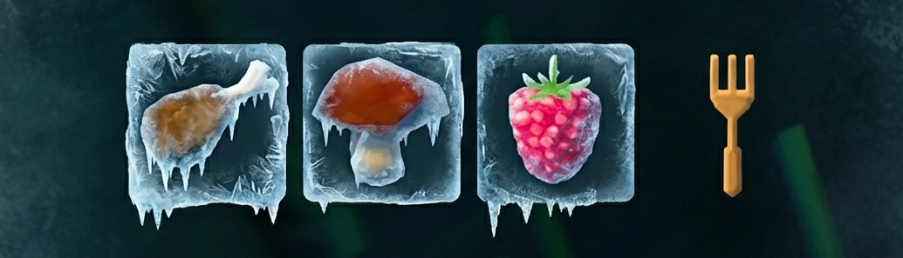

# ValheimFreezeFoodTimer

A lightweight, high-performance Valheim mod that **freezes the food buff timer**. Keep your food buffs active indefinitely without the need to constantly eat.

## Why use Freeze Food Timer?

Stop worrying about your food depletion timers during long building sessions or exploration. This mod ensures your food buffs remain at their maximum duration, allowing you to focus on the game instead of your food status bars.

## Features

- **Infinite Food Buffs:** Effectively pauses the food decay timer while active.
- **Zero Performance Impact:** Uses low-level `Harmony` patching. No heavy loops, no polling, no lag.
- **Vanilla-Friendly:** Clean, client-side implementation. Perfect for multiplayer sessions.
- **Plug-and-Play:** No complex config files. Just install and enjoy.

## Installation

1. Visit the [Releases](https://www.google.com/search?q=https%3A%2F%2Fgithub.com%2FvsDizzy%2FValheimFreezeFoodTimer%2Freleases) page.
2. Download the latest `ValheimFreezeFoodTimer.zip`.
3. Extract the `.dll` file into your `BepInEx/plugins/` folder.
